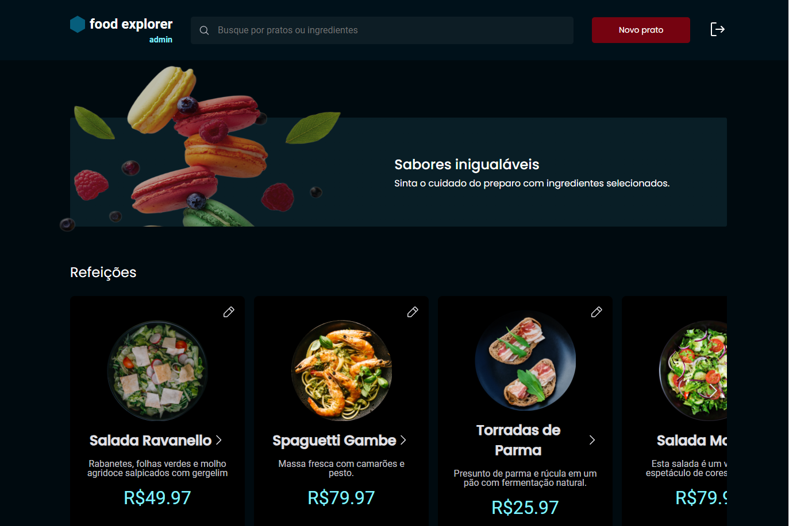

# FoodExplorer

A aplicação que desenvolveremos é um cardápio digital para um restaurante fictício, conhecido como foodExplorer.

- 

- [Link do deploy no NETLIFY](https://foodexplorer-joc3.netlify.app/)
## Rodando localmente

Clone o projeto

```bash
  git clone https://github.com/jocelitojr2/foodexplorer
```

Entre no diretório do projeto

```bash
  cd my-project
```

Instale as dependências

```bash
  npm install
```

Inicie o servidor

```bash
  npm run dev
```

Contas para utilizar.

```bash
  Cliente ⬇
  email: cliente@email.com
  senha: 123

  Administrador ⬇
  email: admin@email.com
  senha: 123
```


## Dependências do Projeto.

* [Styled Components](https://styled-components.com/docs/basics#installation): Utilizado para escrever estilos CSS dentro dos componentes React.
* [Axios](https://axios-http.com/docs/intro): Cliente HTTP baseado em Promises para fazer requisições ao servidor.
* [React Router Dom](https://v5.reactrouter.com/web/guides/quick-start): Biblioteca de roteamento para React que permite a navegação entre diferentes páginas em uma aplicação SPA (Single Page Application).
* [React Icons](https://react-icons.github.io/react-icons/): Biblioteca de ícones para React, que facilita a inclusão de ícones populares na aplicação.
* [Swiper](https://swiperjs.com/get-started): Biblioteca para criação de sliders/carousels modernos e responsivos.

